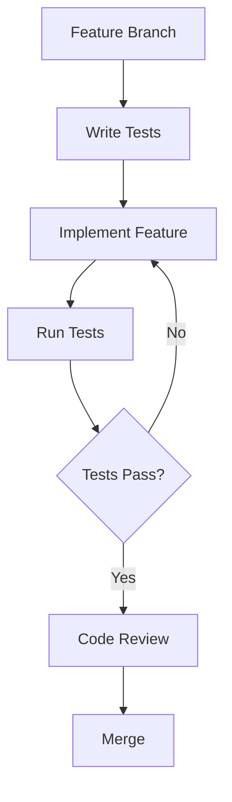

# Architecture Overview

## Testing Architecture

### 1. Framework
We use Swift Testing framework as our primary testing tool, which provides:
- Declarative test syntax with macros
- Built-in async/await support
- Parameterized testing capabilities
- Test organization with tags and traits

### 2. Test Organization Structure
```
magical-stories/
├── magical-storiesTests/
│   ├── Unit/
│   │   ├── Models/
│   │   ├── Services/
│   │   └── Utils/
│   ├── Integration/
│   │   ├── NetworkTests/
│   │   ├── StorageTests/
│   │   └── SystemTests/
│   └── Helpers/
├── magical-storiesUITests/
│   ├── Flows/
│   ├── Components/
│   └── Helpers/
└── Views/
    └── [View]_Tests.swift
```

### 3. Test Categories

#### Unit Tests
- Test individual components in isolation
- Mock dependencies using protocols
- Focus on business logic validation
- Quick execution time

#### Integration Tests
- Test component interactions
- Validate data flow between modules
- Test external service integration
- Use real or simulated dependencies

#### UI Tests
- Test user interface flows
- Validate UI component behavior
- Check accessibility compliance
- Test device-specific features

#### Preview Tests
- Test SwiftUI view configurations
- Validate layout and styling
- Check dynamic content adaptation
- Test view state transitions

### 4. Test Data Management

#### Test Data Sources
- In-memory test doubles
- Local JSON test data
- Mock network responses
- Dedicated test databases

#### Data Isolation
- Separate test environments
- Clean state between tests
- Isolated storage paths
- Controlled network access

### 5. Continuous Integration

#### Test Automation
- Automated test runs on PR
- Parallel test execution
- Device farm integration
- Coverage reporting

#### Quality Gates
- Minimum coverage requirements
- Performance benchmarks
- UI test stability metrics
- Memory leak detection

### 6. Testing Tools

#### Development Tools
- Xcode test navigator
- Test result bundles
- Coverage reports
- Performance metrics

#### Custom Tools
- Test data generators
- Mock generators
- Custom test runners
- Reporting tools

### 7. Test Process Integration

#### Development Workflow


#### Review Process


### 8. Test Maintainability

#### Documentation
- Test purpose and scope
- Setup requirements
- Test data dependencies
- Known limitations

#### Best Practices
- Single responsibility
- Clear naming conventions
- Minimal setup complexity
- Regular maintenance

### 9. Cross-Platform Testing

#### Platform-Specific Tests
- iOS-specific features
- macOS compatibility
- watchOS limitations
- Cross-platform shared code

#### Conditional Testing
```swift
@Test("Platform-specific feature")
func testFeature() {
    #if os(iOS)
    // iOS-specific test
    #elseif os(macOS)
    // macOS-specific test
    #endif
}
```

### 10. Performance Considerations

#### Test Optimization
- Parallel test execution
- Minimal setup/teardown
- Efficient test data
- Resource cleanup

#### Monitoring
- Execution time tracking
- Memory usage analysis
- Network request logging
- Storage impact measurement

## Integration with Other Architecture Components

### 1. Data Layer
- Repository pattern testing
- Data transformation validation
- Persistence verification
- Cache behavior testing

### 2. Domain Layer
- Business logic validation
- Use case testing
- Domain event testing
- Validation rule testing

### 3. Presentation Layer
- ViewModel testing
- UI state management
- User interaction flow
- Error presentation

### 4. Infrastructure
- Network layer testing
- Storage layer testing
- Security testing
- Configuration testing

## Future Considerations

### 1. Scalability
- Test suite optimization
- Parallel execution strategies
- Resource management
- CI/CD pipeline efficiency

### 2. Maintenance
- Regular test review
- Dead code removal
- Performance optimization
- Documentation updates

### 3. Evolution
- New testing frameworks
- Improved tooling
- Enhanced automation
- Better reporting
