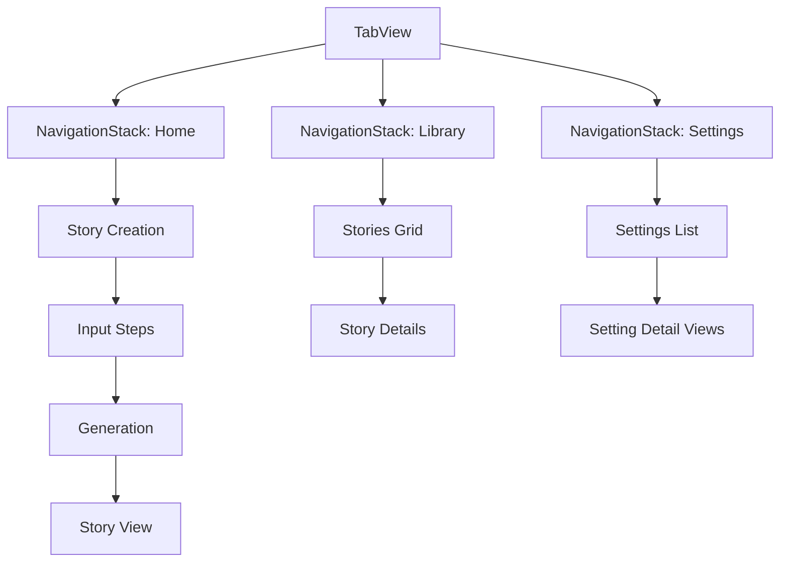

# UI Architecture

## Overview
This document outlines the UI architecture for the Magical Stories app, detailing the navigation structure, view hierarchy, and implementation phases.

## Navigation Structure

The app uses SwiftUI's native navigation components with a TabView as the root container and NavigationStack for each main section.



## View Hierarchy

### Root Level
- `RootView` (TabView)
  - `HomeView`
  - `LibraryView`
  - `SettingsView`

### Home Tab (Story Creation)
- `HomeView`
  - `StoryInputView`
    - Multi-step form using push navigation
    - Progress indicator
    - Input validation
  - `StoryProgressView`
    - Generation status
    - Loading animations
  - `StoryDisplayView`
    - Story content
    - Reading controls
    - Share/Save options

### Library Tab
- `LibraryView`
  - `StoryGridView`
    - Grid/List toggle
    - Search bar
    - Filter controls
  - `StoryDetailView`
    - Full story display
    - Story metadata
    - Action buttons

### Settings Tab
- `SettingsView`
  - Profile section
  - App preferences
  - Parental controls
  - `SettingDetailView` for complex settings

## Component Architecture

### Reusable Components
1. Input Components
   - `ThemedTextField`
   - `StoryThemePicker`
   - `CharacterSelector`
   - `AgeRangePicker`

2. Display Components
   - `StoryCard`
   - `ProgressIndicator`
   - `AnimatedPageView`
   - `FilterChip`

3. Navigation Components
   - `TabBar`
   - `NavigationHeader`
   - `BackButton`

### Custom Modifiers
```swift
// Example modifiers
.cardStyle()
.inputFieldStyle()
.navigationBarStyle()
```

## Implementation Phases

### Phase 1a: Core Navigation
- TabView setup
- Navigation stack implementation
- Basic routing

### Phase 1b: Story Creation (MVP)
- Input form views
- Progress indicators
- Story display

### Phase 1c: Library & Settings
- Grid/List views
- Basic settings UI
- Storage integration

## Accessibility Considerations

- Dynamic Type support
- VoiceOver optimization
- Sufficient color contrast
- Clear navigation hierarchy
- Readable text sizes

## Animation Guidelines

1. Transitions
   - Push/pop navigation: standard slide
   - Tab switching: fade cross-dissolve
   - Modal presentations: vertical slide

2. Interactive Elements
   - Button feedback: scale
   - Selection changes: fade
   - Progress updates: smooth interpolation

## Testing Strategy

1. UI Unit Tests
   - Component rendering
   - State management
   - User input handling

2. Integration Tests
   - Navigation flows
   - Data persistence
   - API integration

3. Accessibility Tests
   - VoiceOver functionality
   - Dynamic Type scaling
   - Color contrast validation

## Future Considerations

1. Enhanced Features
   - Rich animations
   - Gesture controls
   - Haptic feedback
   - Advanced transitions

2. iPad Optimization
   - Split views
   - Sidebars
   - Drag and drop
   - Keyboard shortcuts

3. Performance
   - View recycling
   - Lazy loading
   - Image caching
   - Memory management

## Best Practices

1. View Organization
   - Clear file structure
   - Consistent naming
   - Modular components
   - Clean interfaces

2. State Management
   - Clear ownership
   - Predictable updates
   - Error handling
   - Loading states

3. Code Style
   - SwiftUI conventions
   - Documentation
   - Type safety
   - Preview support
